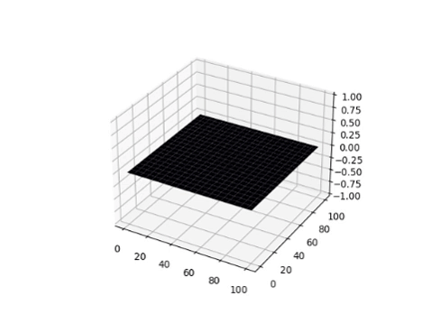

# Projeto 1

O objetivo deste Projeto é desenvolver um código ou algoritmo que envolve a implementação do algoritmo FDTD (Finite-Difference Time-Domain) para visualização de tensão V(z,t)
e corrente I(z,t) (transiente) em uma linha de transmissão sem perdas, baseado nas equações do
telegrafista.

Todos os parâmetros são configuráveis no código, Tais como Z0 (impedância característica), Zg(impedância do gerador), Zl(impedância da carga), fonte_1 e fonte_2.
Para adotar uma impedância infinita a Zl, basta atribuir Zl = math.inf.
Os demais parâmetros também estão explicados no código.

# Projeto 2
O objetivo deste projeto é implementar o algoritmo FDTD (Finite-Diference Time-Domain) para a visualização do Campo Elétrico e do Campo Magnético sobre um espaço unidimensional, bem como analisar a estabilidade do algoritmo através da relação entre tamanho dos passos dt e dx, relacionados por S.

# Projeto 3
O objetivo deste projeto é implementar o algortimo de Yee para a visualização de Campo Elétrico e Magnético sobre um espaço unidimensional (1-D) e bidimensional (2-D). Parâmetros como condutância, Permissividade e Permeabilidade são ajustáveis. Há três tipos de excitações configuradas: Degrau Unitário, Pulso Gaussiano e Senoidal. Essas fontes estão posicionadas no centro da malha bidimensional.

### Exemplo

# Bibliotecas Necessárias

Para executar este código é necessário ter o interpretador python instalado, bem como os módulos que serão utilizados no código. É possível instalar os módulos através do comando pip:

pip install matplotlib
pip install numpy
pip install scipy
